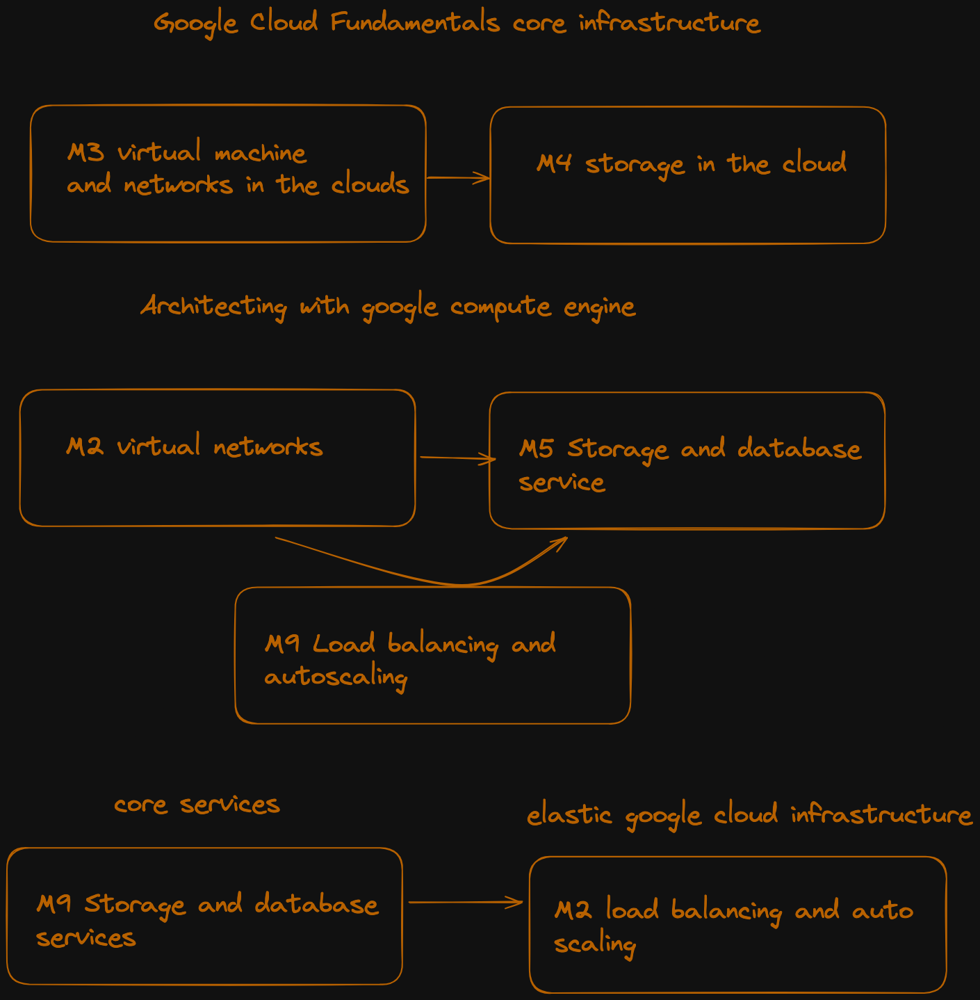
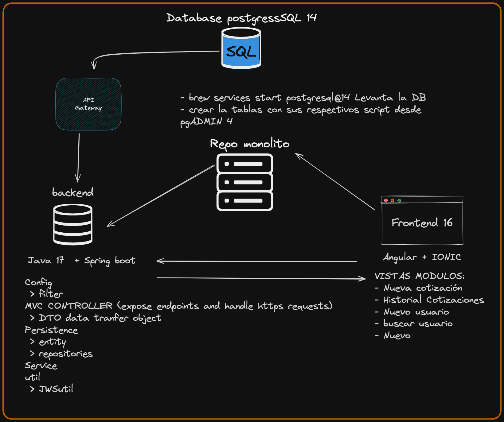
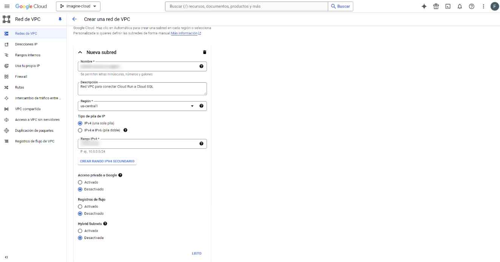
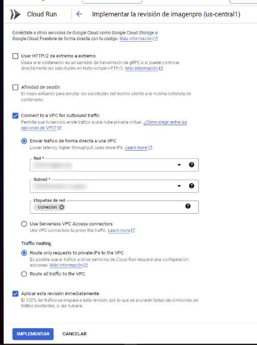
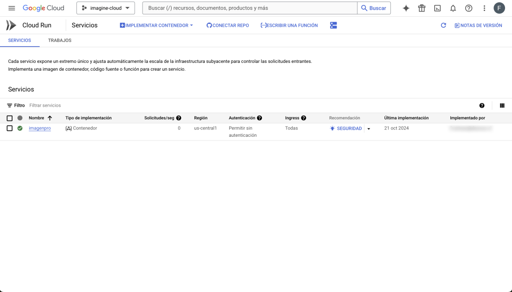
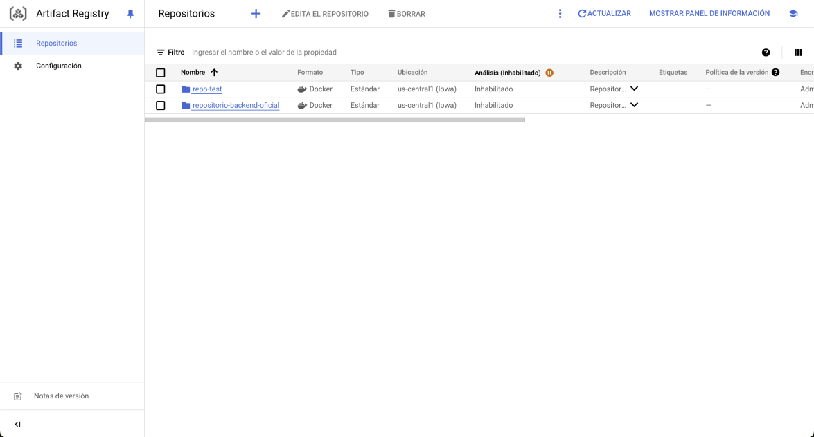
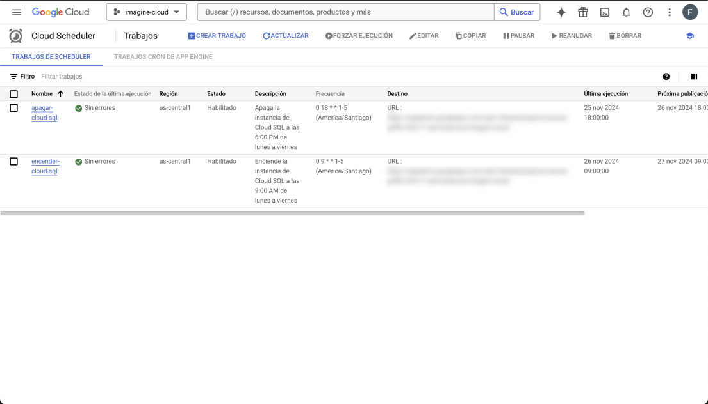

# LÍDER DE PROYECTO DEVOPS

**Octubre 2024 - Presente**

## Migración de una Aplicación Web de Cotizaciones para el Equipo de Ventas

Liderando un equipo de 3 miembros en la migración completa de una aplicación que optimiza los procesos de cotización, automatizando cálculos de precios, IVA y totales, mejorando la eficiencia operativa del departamento de ventas.

---

### **Logros Clave y Responsabilidades**

- **Planificación y Análisis**: Diseñé el plan de migración asegurando la integración fluida de las tecnologías existentes.
- **Google Cloud**: Configuré Cloud SQL con PostgreSQL 14 e integré servicios de backend utilizando Spring Boot.
- **Contenedores y Automatización**: Implementé Docker y Cloud Build para gestionar despliegues automatizados.
- **Despliegue del Frontend**: Configuré Continuous Delivery en Render para una aplicación construida con Angular e Ionic.
- **Pruebas de Rendimiento**: Realicé pruebas de estrés con JMeter, garantizando estabilidad con 500 usuarios concurrentes.
- **Documentación**: Creé un documento detallando el proceso paso a paso para ejecutar pipelines, configurar Cloud SQL y establecer artefactos en Cloud Run dentro de la sección de "instancias". También documenté los trabajos para iniciar y detener la instancia.

---

### **Impacto del Proyecto**

- **Reducción de Tiempos Operativos**: Generación de cotizaciones más rápida y precisa.
- **Centralización de Datos**: Toda la información disponible en Cloud SQL para mejorar la trazabilidad.
- **Automatización de Facturas**: Generación de facturas en PDF directamente desde el panel de control.
- **Despliegue Continuo**: Actualizaciones fluidas gracias a pipelines automatizados.

---

### **Tecnologías Utilizadas**

**Angular**, **Ionic**, **Spring Boot**, **Docker**, **Google Cloud**, **Cloud SQL**, **JMeter**

---

### **Resumen del Proceso**

#### Planificación y Orquestación para Infraestructura en Google Cloud

Antes de configurar la base de datos en **Cloud SQL** y crear el contenedor con su imagen, dediqué una semana completa a orquestar y planificar el proceso. Este enfoque garantizó una implementación fluida y eficiente.

Durante esta fase de preparación, me centré en comprender los conceptos clave de la infraestructura de Google Cloud:

- **Modelos de Precios**: Analicé las estructuras de costos para optimizar el presupuesto según los requisitos del proyecto.
- **Gestión de Roles IAM**: Configuré y asigné roles seguros para garantizar un control adecuado del acceso a los recursos.
- **Configuración del SDK**: Configuré el Google Cloud SDK para facilitar su uso con Cloud Shell y habilitar conexiones desde máquinas locales.
- **Compute Engine**: Analicé las funcionalidades de Compute Engine para gestionar y configurar instancias de máquinas virtuales de manera eficiente.
- **Cloud SQL**: Planifiqué y configuré bases de datos escalables y de alto rendimiento en Cloud SQL.
- **Herramientas Clave**: Identifiqué e integré herramientas esenciales para garantizar el éxito del proyecto.

---

### **Capturas de Pantalla**

#### Fundamentos de Cloud

#### Flujo de la Aplicación Web

#### Crear Red

#### Conectar a una VPC

#### Cloud Run

#### Artefactos

#### Trabajos

---

### **Video del Flujo de la Aplicación**

