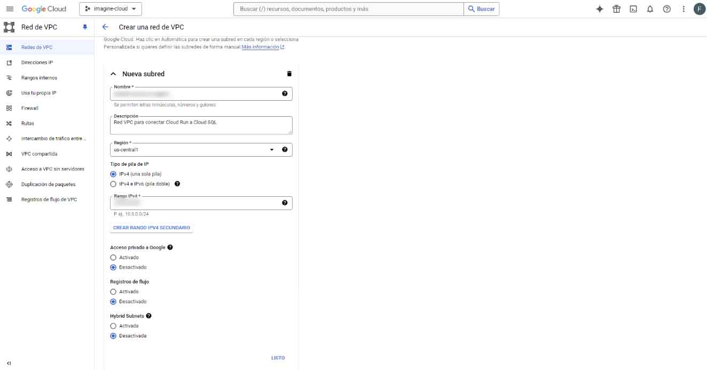
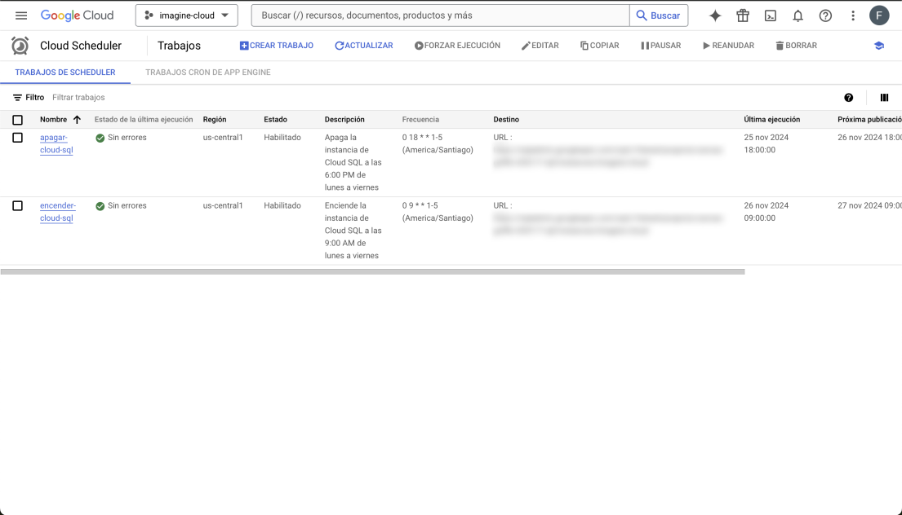

# DEVOPS PROJECT LEADER

**October 2024 - Present**

## Migration of a Quotation Web Application for the Sales Team

Leading a team of 3 members in the complete migration of an application that optimizes quotation processes, automating price, VAT, and total calculations, enhancing the operational efficiency of the sales department.

---

### **Key Accomplishments and Responsibilities**

- **Planning and Analysis**: Designed the migration plan ensuring the seamless integration of existing technologies.
- **Google Cloud**: Configured Cloud SQL with PostgreSQL 14 and integrated backend services using Spring Boot.
- **Containers and Automation**: Implemented Docker and Cloud Build to manage automated deployments.
- **Frontend Deployment**: Set up Continuous Delivery in Render for an application built with Angular and Ionic.
- **Performance Testing**: Conducted stress tests with JMeter, ensuring stability with 500 concurrent users.
- **Documentation**: Created a document explaining the step-by-step process for running pipelines, configuring Cloud SQL, and setting up artifacts in Cloud Run under the "instance" section. Also documented the jobs for starting and stopping the instance.

---

### **Project Impact**

- **Operational Time Reduction**: Faster and more accurate quotation generation.
- **Data Centralization**: All information available in Cloud SQL for improved traceability.
- **Invoice Automation**: PDF invoices generated directly from the dashboard.
- **Continuous Deployment**: Seamless updates thanks to automated pipelines.

---

### **Technology Stack**

**Angular**, **Ionic**, **Spring Boot**, **Docker**, **Google Cloud**, **Cloud SQL**, **JMeter**

---

### **Media Overview**

# Planning and Orchestration for Google Cloud Infrastructure

Before configuring the database in **Cloud SQL** and creating the container with its image, I dedicated a full week to orchestrating and planning the entire process. This approach ensured a smooth and efficient implementation.

During this preparation phase, I focused on understanding the core concepts of Google Cloud’s infrastructure:

- **Pricing Models:** Studied the pricing structures to optimize costs based on project requirements.
- **IAM Roles Management:** Configured and assigned secure roles to ensure proper access control for all resources.
- **SDK Configuration:** Set up the Google Cloud SDK for seamless use with Cloud Shell and to enable connections from local machines.
- **Compute Engine:** Analyzed Compute Engine functionalities to efficiently manage and configure virtual machine instances.
- **Cloud SQL:** Planned and configured scalable and high-performing databases in Cloud SQL.
- **Key Tools:** Identified and integrated essential tools to ensure successful project execution.

#### Application Interface Screenshot

## Cloud fundamentals

## Web app flow

## Create network

## Connect to a vpc

## Cloud Run

## Artifacts

## Jobs

